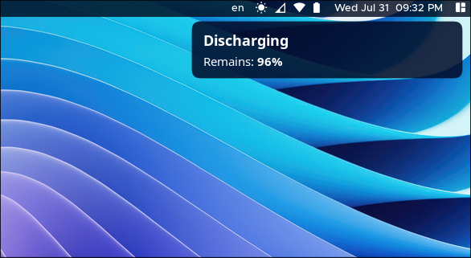

# Battery_Notify


**A simple light-weight battery notifier script written for Hyprland WM users.**

Since Hyprland WM doesn't have default notifications for when the battery is charging, discharging, full, or under a low battery warning, you might not be aware of your current battery status.

So, I wrote this script to solve that problem ;)

# How it works
## battery_notify.sh
This script works similarly to like others' battery notification scripts. The only difference is that it <b>won't repeat</b> the status notification. Each time your battery is charging, discharging, or fully charged, the script will only notify you once.

## battery_warning.sh
This script notifies you if the battery is too low that your computer might shut down at any moment. When the battery capacity drops below **15%**, it will alert you to save your work before an imminent shutdown.


# How to use
Required Packages
``` bash
sudo pacman -Sy --needed mplayer brightnessctl libnotify
```

Download and make the scripts executable:
```
git clone https://github.com/miniMinn24/Battery_Notify.git
cd Battery_Notify
chmod +x *.sh
```

Start as background processes, e.g., in your hyprland.conf:
```
exec-once = /PATH/TO/battery_notify.sh &
exec-once = /PATH/TO/battery_warning.sh &
```

